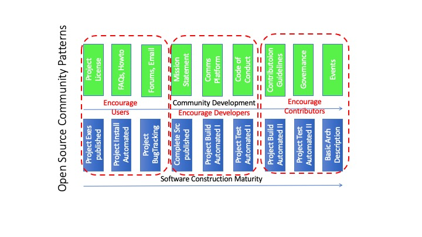

# What healthy open source software projects look like (On-ramps and practices)

## Objectives
* Understand the general roles in a project community
* Understand the simple community dynamic in community 
* Understand the on-ramps and activities successful project communities display

## Notes
### In the beginning ... 
An open source software project starts when someone publishes source code using an OSI-approved license. 
But what makes a project a success? 
For the purposes of this course, we are going to consider a project with a healthy flow of inbound contributions to be a successful project. 
Using inbound contributions rather than outbound use is a very deliberate perspective. 
If we think about outbound uses and users, it can be difficult to count. 
* Did someone star a GitHub repo because they are a simple end user, or because they follow the developer, or because they are a developer using the source? 
* Did someone clone/fork a repo and use it, or abandon the project fork, or simply review and learn from it? 

If we look at an inbound contribution flow, regardless of what we count as a contribution, then we have some confidence that the contributor is an active user. 
Let's look at some simple role definitions:
* Maintainer: a primary author of a project with full privileges to write the project directory tree. 
* User: any person that is using a software project for its intended purpose.
* Developer: any person using a software project but futhermore also modifying the source to their own needs. 
* Contributor: any person offering a direct artifact back to the project, including source code patches, bug reports, configuration, documentation. 

A maintainer has a responsibility to the project. The creator or creators of a project are maintainers. 
They agreed on the initial license as their outbound social contract. 
They published the initial software, sharing it outbound using a liberal (OSI-approved) license in the hope that others would find it useful.
They set the direction and roadmap for the project. 
They share the responsibility for the outcomes. 

Users enjoy the fruits of the labour of the project maintainers and contributors. 
They still identify with the tribe around the project and act as advocates for the project. 

Developers are users that have taken the further step of downloading the project source to extend the project to some personal end. 
It could be to fix a bug. It could be to add substantial new functionality. 

Contributors give back to the project. In an earlier lesson, we saw how living on a fork of a project as a developer can be costly over time.
One isn't keeping up with the new functionality or bug fixes that may be flowing back to the project. 
Not having one's extensions and fixes accepted back into the main project tree means the cost of new integration is higher. 
It pays to contribute back any project extenstions. 
But it also pays to contribute back other artifacts. 
* Contributing a bug report still helps the project. The bug indicates a new test path or use. While the reporter may not know how to fix the bug, others might. 
* Contributing new configuration information broadens the user base.
* Contributing documentation (answering forum questions, creating tutorials, etc.) broadens the user base. 

### On-ramps 
I was watching a presentation on building community in an open source project 20 years ago at a conference. 
The project involved a relatively small specialized community of developers working on video drivers for Linux. 
In the presenter's eyes, the ten developers that knew the most about the project topic were members of this community. 
The presenter offered the following anecdotal observation: for every 1000 users they had, they would receive about 100 bug reports, and about 10 patches, 
out of which one had read their contribution guidelines. 
I was sitting with the primary maintainer for a much larger project and they confirmed those numbers seemed about right. 

This orders-of-magnitude measure seems to be more related to communities of people than anything inherent in software development. 
I have asked rooms full of community managers for a show of hands around the following questions with respect to the neighbourhoods in which they live in the real world:
* How many people have reported potholes in their street or burned out street lamps? Typically about 10% hold up their hands. 
* How many organize the neighbourhood block party? Typically about 1% hold up their hands. 

All of them identify with living in their neighbourhoods for a wealth of personal reasons from commute time to schools to friends and family. 
From an open source project perspective, maintainers need to drive three on-ramps into a project: 
1. How to encourage people to use the project? (That is where project maintainers will find bugs reporters and developers.)
1. How to encourage developers selfishly to experiment? (These are the future potential contributors.)
1. How to encourage developers to share their work back to the project? (One can't rely on developers necessarily contributing unless it is easy.)

Another way to cast these questions is: 
1. How to make it easy to install, configure, and use the software project? 
1. How to make it easy for a developer without prior knowledge to build and test the software project to a known state? 
1. How to make it easy to contribute changes back to the project maintainers? 

### Project Activities
What activities are then necessary to support these on-ramps? 
We are going to look at the collection of activities through two groups from the perspective of the maintainers:
* Software construction activities. 
* Community development activities. 

### Software Construction Activities
These are the block-and-tackle activities for the maintainers that put in place the infrastructure to make it easy for users to adopt the project, 
and developers to consume the project and hopefully turn those developers and users into contributors. 
This list is not meant to be perfect nor comprehensive, 
but it gives a sense of how certain activities should be considered and their intent. 
1. Project executables are built and available on known platforms. 
1. Project executable software has an automated installer for known platforms. 
1. Bugtracking or issue tracking is available. 
1. Complete source is published and easy to download. 
1. Project build is automated or scripted for known platforms. 
1. Project can be tested to a known state for known platforms. 
1. Project build is sophisticated enough to support easy contributions. 
1. Project testing is sophisticated enough to support easy contributions. 
1. Architectural documentation exists as well as roadmap discussions. 

### Community Development Activities 
These are the building block activities for the maintainers that begin to create a sense of community for users, developers, and contributors.   to make it easy for users to adopt the project, 
and developers to consume the project and hopefully turn those developers and users into contributors. 
Again, this list is not meant to be perfect nor comprehensive, 
but it gives a sense of how certain activities should be considered and their intent. 
1. The project license is easy to find.
1. There is easy on-boarding documentation like a Frequently Asked Questions (FAQ), How-to documents, or startup tutorials. 
1. There is an easy engagement mechanism like an IRC channel, email distribution list, or forum. 
1. There is a mission statement that is clear.
1. There is a Code-of-Conduct. 
1. There is a well organized communications 'platform' where there is clear direction on what channels to use for what purpose. 
1. There are contribution guidelines.
1. The project governance is well documented. 
1. There are real world events such as conference Birds-of-a-Feather (BoF) gatherings, or Meet-ups. 

These activities in these two collections (software construction and community building) also group nicely around which group of people you are looking to engage.

Contributing indirectly still provides benefits as the community of contributors grows. 
Rotor
Freeloaders
Ask not ... 

