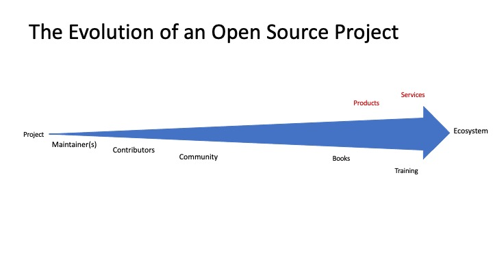
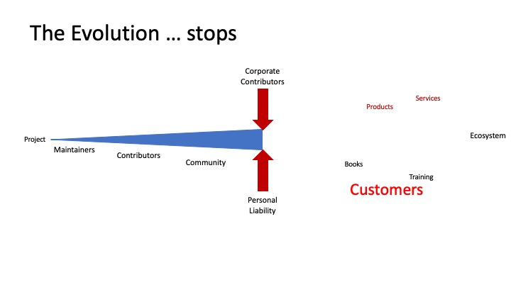
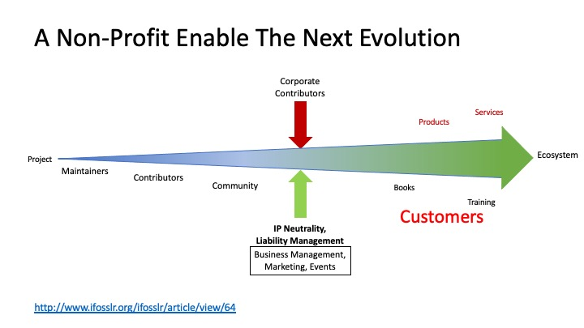
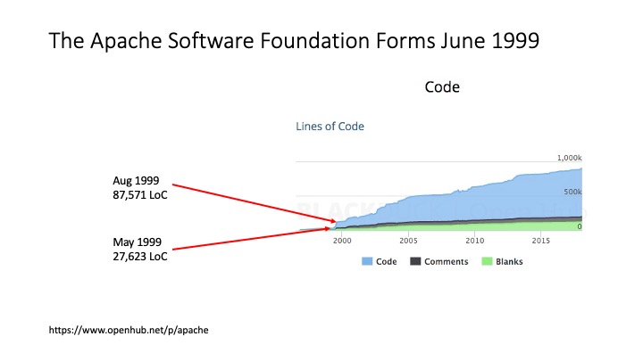
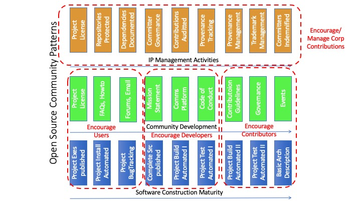

# Scaling projects up even more (The role of non-profits in an open source enabled world) 

## Objectives
* Understand the growth problems of legal liability
* Understand how a non-profit company solves for liability
* Understand how a non-profit can enable and encourage the next wave of growth 
* Have some understanding of current challenges in the non-profit space

## Notes

To attract contributions and new maintainers, the project needs to be easy to deploy and use, 
easy to fork and build and experiment with, and finally create an easy path for such experiments to flow back. 
Making it easy for users to contribute more than just code will expand the project’s use.  

In a project’s growth curve, regardless of project ownership, two problems can constrain growth.  
* Companies wanting to use the project in their solutions to customers often want clear IP practices, and neutral ownership.  
* Project maintainers cannot sustain the personal liability for the project for activities like events or costs around the infrastructure.  

Non-profit organizations solve these problems, allowing new users to participate and the project message to grow. 
Bringing a project to an existing non-profit (or creating a new non-profit in strategic domains) benefits the project’s growth.  
* The non-profit adds stability to a project. It can: 
  - Provide direct services out of the budget (website, CI/CD, communications, etc.). 
  - Provide mentorship and experience (e.g. tooling, processes, governance (Code-of-Conduct), etc.). 
  - Guide, aid, and support capturing attention (events, meetups, collateral). 
  - Provides a backstop to protect the project. 
* The non-profit removes liability from the project (holding the bank account, signing the contract for meetups, etc.).  
* The non-profit is a center-of-gravity in the industry to attract relevant attention to the project from members as well as the industry broadly 
(meaning it is an opportunity to attract users -> developers -> contributors to the project).  
* The non-profit as a holder of IP rights provides a more neutral space and known IP governance, 
encouraging further use of projects in product and service portfolios for project growth from other companies.  
* The non-profit provides a community focus on discussions and collaborative innovations across projects. 
 

